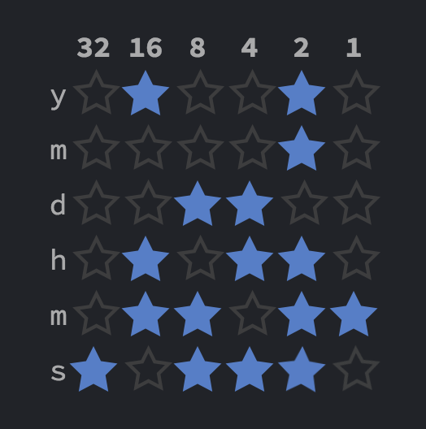

# vue-electron-watch

## Binary Clock

2進数表記の時計

右クリックでカラーピッカーが出ます



## Build Setup

``` bash
# install dependencies
yarn install

# serve with hot reload at localhost:9080
yarn run dev

# build electron application for production
yarn run build


# lint all JS/Vue component files in `src/`
yarn run lint

```
